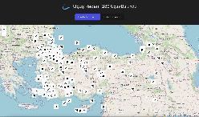

# Flight_Radar
Merhaba, bu proje React Toolkit ve Redux Thunk kullanılarak geliştirilmiş bir uçuş radarı uygulamasıdır. Proje, RapidAPI üzerinden alınan Flight-radar API verileriyle, kullanıcının girdiği lokasyon üzerindeki tüm uçuşları canlı olarak görüntülemektedir. Harita gösterimi için Leaflet kütüphanesi kullanılmıştır. Proje, uçuşları takip etmek için iki ana sayfa sunmaktadır: bir harita sayfası ve bir liste sayfası. Kullanıcılar, her iki sayfadan da uçuşlarla ilgili detaylara erişebilirler.

# flight_radar
